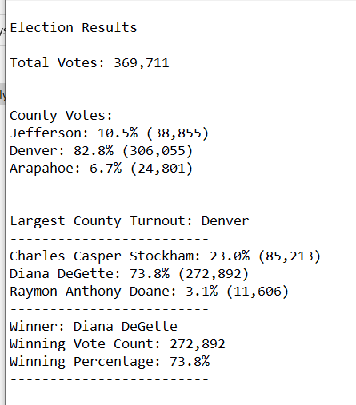

# Election_Analysis
Module 3 - Python - Election Analysis
## Overview of Election Audit
A Colorado Board of Educations employees has given the  task of completing the election audit of a recent local congressional elections. They need to see the total votes for each candidate and county, list of candidates who received votes, which candidate won and percentage for each candidate and county and the winner of the election and largest county turnout.
## Resources
-Data Source: election_results.csv
-Softaware: Phython 3.7 VS code 1.62.3
## Election-Audit Results
The analysis of the election show that:
- There were 369,711 votes cast in the election
- There were 3 counties in the election and they were: Jefferson, Denver and Arapahoe
- The county resulst in terms of breakdown of the # of votes and the percentage of total votes for each county:
  - Jefferson received 10.5% of the vote and 38,855 votes
  - Denver received 82.8% of the vote and 306,055 votes
  - Arapahoe received 6.7% of the vote and 24,801 votes
- Largest county turnout was in Denver
- The candidate results are listed below. The candidates who participated to elections were Charles Casper Stockham, Diana DeGett and Raymon Anthony Doane
  - Charles Casper Stockham received "23%" of the vote and "85,213" number of votes
  - Diana DeGett received "73.8%" of the vote and "272,892" number of votes
  - Raymon Anthony Doane received "3.1%" of the vote and "11,606" number of votes
- The winner of the election was:
  - Candidate Diana DeGette who received "73.8%" of the vote and "272,892" number of votes

  The following images show the result of the elections printed on the screen and written into a text file.
  

## Election-Audit Summary
My proposal to the election committee is as follows.
Election data source name is hard coded in this script as "election_results.csv". The user can be asked to provide the data file name and that the code should be modified to accept the user entered data file and location. 
In the script two loops are used to iterate once for the candidate data and once for the county data. Candidate data is read from column 3 and county data in column 2 and these are hard coded in the main section. To reduce repetitions he script can be modified to call a function to receive which data whether candidate or county to be iterated and returns the result. This would speed up the run time, shorten the code, allow us to write quality code. 

 
